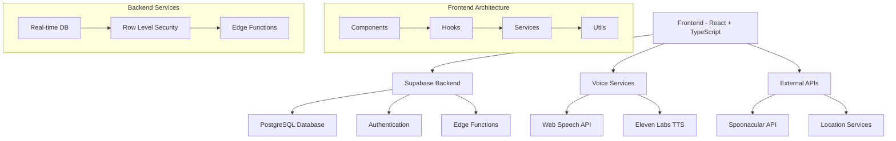

# 🍳 ChefSpeak - AI-Powered Voice Cooking Assistant

<div align="center">
  
  
  [](https://opensource.org/licenses/MIT)
  [](https://reactjs.org/)
  [](https://www.typescriptlang.org/)
  [](https://supabase.com/)
  [](https://tailwindcss.com/)
  
  **Your intelligent voice-powered cooking companion with multi-language support and AI-enhanced features**
</div>

---

## 📋 Table of Contents

- [🌟 Features](#-features)
- [🏗️ Architecture](#️-architecture)
- [🚀 Quick Start](#-quick-start)
- [⚙️ Configuration](#️-configuration)
- [🗣️ Voice Features](#️-voice-features)
- [🌍 Multi-Language Support](#-multi-language-support)
- [📱 User Interface](#-user-interface)
- [🔧 API Integration](#-api-integration)
- [🗄️ Database Schema](#️-database-schema)
- [🔐 Security](#-security)
- [📊 Performance](#-performance)
- [🧪 Testing](#-testing)
- [🚀 Deployment](#-deployment)
- [🤝 Contributing](#-contributing)
- [📄 License](#-license)

---

## 🌟 Features

### Core Functionality
| Feature | Description | Status |
|---------|-------------|--------|
| 🎤 **Voice Recognition** | Advanced speech-to-text with multi-language support | ✅ Active |
| 🔊 **AI Voice Synthesis** | High-quality text-to-speech using Eleven Labs | ✅ Active |
| 🍽️ **Recipe Discovery** | 20,000+ recipes with intelligent search | ✅ Active |
| 🥘 **Ingredient-Based Search** | Find recipes by available ingredients | ✅ Active |
| 👥 **Community Features** | User-generated recipes and reviews | ✅ Active |
| 📅 **Meal Planning** | Weekly meal planning with calendar view | ✅ Active |
| 🛒 **Smart Shopping Lists** | Auto-generated from meal plans | ✅ Active |
| ⏱️ **Cooking Timers** | Voice-controlled cooking timers | ✅ Active |
| 📊 **Nutrition Analysis** | Detailed nutritional information | ✅ Active |
| 🌍 **Multi-Language** | 5 languages with localized content | ✅ Active |

### Advanced Features
- **AI-Powered Recommendations**: Personalized recipe suggestions
- **Voice-Controlled Cooking Mode**: Hands-free cooking experience
- **Location-Based Recipes**: Local cuisine suggestions
- **Social Sharing**: Share recipes across platforms
- **Offline Support**: PWA with offline capabilities
- **Responsive Design**: Optimized for all devices

---

## 🏗️ Architecture



### Technology Stack

| Layer | Technology | Purpose |
|-------|------------|---------|
| **Frontend** | React 18.3.1 + TypeScript | Modern UI with type safety |
| **Styling** | Tailwind CSS 3.4.1 | Utility-first CSS framework |
| **Backend** | Supabase | Database, Auth, Real-time |
| **Database** | PostgreSQL | Relational data storage |
| **Voice AI** | Eleven Labs | High-quality TTS |
| **Speech** | Web Speech API | Browser-native STT |
| **Recipes** | Spoonacular API | Recipe data and nutrition |
| **Build Tool** | Vite 5.4.2 | Fast development and builds |
| **Deployment** | Netlify | Static site hosting |
| **Localization** | Lingo.dev CLI | AI-powered translations |

---

## 🚀 Quick Start

### Prerequisites
- Node.js 18+ and npm
- Supabase account
- Eleven Labs API key (optional)
- Spoonacular API key (optional)
- Groq API key (for translations)

### Installation

1. **Clone the repository**
   ```bash
   git clone https://github.com/your-username/chefspeak.git
   cd chefspeak
   ```

2. **Install dependencies**
   ```bash
   npm install
   ```

3. **Environment setup**
   ```bash
   cp .env.example .env
   ```
   
   Fill in your environment variables:
   ```env
   VITE_SUPABASE_URL=your_supabase_project_url
   VITE_SUPABASE_ANON_KEY=your_supabase_anon_key
   VITE_ELEVEN_LABS_API_KEY=your_eleven_labs_key
   VITE_SPOONACULAR_API_KEY=your_spoonacular_key
   GROQ_API_KEY=your_groq_api_key
   ```

4. **Database setup**
   ```bash
   # Run migrations in Supabase dashboard or CLI
   # Migrations are located in supabase/migrations/
   ```

5. **Start development server**
   ```bash
   npm run dev
   ```

6. **Open in browser**
   ```
   http://localhost:5173
   ```

---

## 🌍 Multi-Language Support

### Supported Languages
| Language | Code | UI | Voice | Recipes |
|----------|------|----|----- |---------|
| English | `en` | ✅ | ✅ | ✅ |
| Spanish | `es` | ✅ | ✅ | ✅ |
| French | `fr` | ✅ | ✅ | ✅ |
| Hindi | `hi` | ✅ | ✅ | 🔶 |
| Telugu | `te` | ✅ | ✅ | 🔶 |

### Translation Management
ChefSpeak uses Lingo.dev CLI for AI-powered translations:

1. **Extract Translations**: All UI strings are stored in JSON files in `src/locales/`
2. **Update Translations**: Run `npx lingo.dev@latest i18n` to update all language files
3. **Add Languages**: Add new target languages in `i18n.json`

### Translation Coverage
- **UI Elements**: 100% translated
- **Voice Commands**: Localized for each language
- **Recipe Content**: English base with localized search
- **Error Messages**: Fully localized

---

## 🤝 Contributing

### Development Workflow
1. **Fork** the repository
2. **Create** a feature branch
3. **Commit** your changes
4. **Push** to the branch
5. **Open** a Pull Request

### Code Standards
- **TypeScript**: Strict mode enabled
- **ESLint**: Airbnb configuration
- **Prettier**: Code formatting
- **Conventional Commits**: Commit message format

### Project Structure
```
src/
├── components/          # React components
│   ├── ui/             # Reusable UI components
│   └── features/       # Feature-specific components
├── hooks/              # Custom React hooks
├── services/           # API and external services
├── utils/              # Utility functions
├── types/              # TypeScript type definitions
├── data/               # Static data and constants
├── locales/            # Translation files
└── lib/                # Third-party library configs
```

---

## 📄 License

This project is licensed under the MIT License - see the [LICENSE](LICENSE) file for details.

### Third-Party Licenses
- **React**: MIT License
- **Supabase**: Apache 2.0 License
- **Tailwind CSS**: MIT License
- **Lucide React**: ISC License

---

<div align="center">
  <h3>🍳 Happy Cooking with ChefSpeak! 🍳</h3>
  <p>Made with ❤️ by the ChefSpeak Team</p>
  
  [](https://github.com/your-username/chefspeak/stargazers)
  [](https://github.com/your-username/chefspeak/network/members)
  [](https://github.com/your-username/chefspeak/issues)
</div>