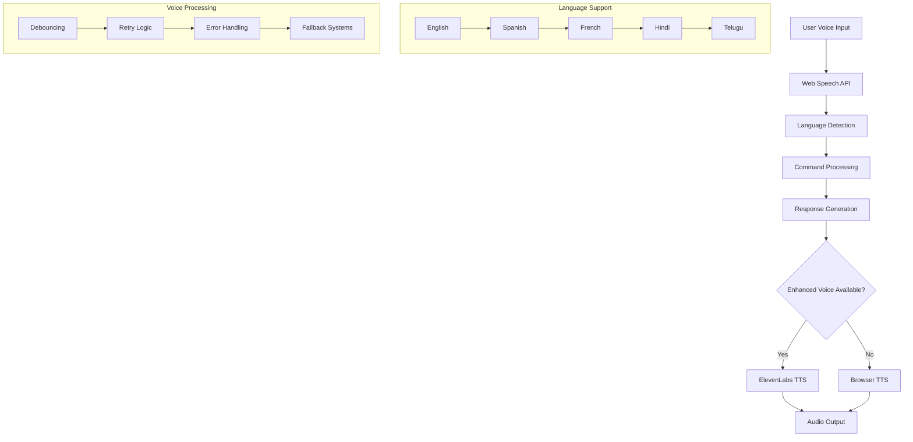
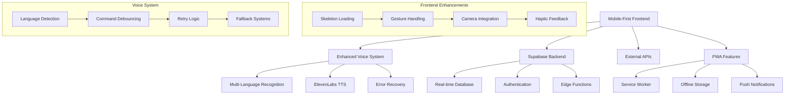

# 🍳 ChefSpeak - AI-Powered Voice Cooking Assistant

<div align="center">
  
  
  [](https://opensource.org/licenses/MIT)
  [](https://reactjs.org/)
  [](https://www.typescriptlang.org/)
  [](https://supabase.com/)
  [](https://tailwindcss.com/)
  [](https://web.dev/progressive-web-apps/)
  
  **Your intelligent voice-powered cooking companion with multi-language support, mobile-first design, and AI-enhanced features**
</div>

---

## 📋 Table of Contents

- [🌟 Features](#-features)
- [📱 Mobile Experience](#-mobile-experience)
- [🗣️ Voice System](#️-voice-system)
- [🌍 Multi-Language Support](#-multi-language-support)
- [🏗️ Architecture](#️-architecture)
- [🚀 Quick Start](#-quick-start)
- [⚙️ Configuration](#️-configuration)
- [📱 User Interface](#-user-interface)
- [🔧 API Integration](#-api-integration)
- [🗄️ Database Schema](#️-database-schema)
- [🔐 Security](#-security)
- [📊 Performance](#-performance)
- [🧪 Testing](#-testing)
- [🚀 Deployment](#-deployment)
- [🤝 Contributing](#-contributing)
- [📄 License](#-license)

---

## 🌟 Features

### Core Functionality
| Feature | Description | Status |
|---------|-------------|--------|
| 🎤 **Advanced Voice Recognition** | Multi-language speech-to-text with real-time switching | ✅ Enhanced |
| 🔊 **AI Voice Synthesis** | ElevenLabs + browser fallback with 18 voice options | ✅ Enhanced |
| 🍽️ **Recipe Discovery** | 20,000+ recipes with intelligent search | ✅ Active |
| 🥘 **Ingredient-Based Search** | Find recipes by available ingredients | ✅ Active |
| 👥 **Community Features** | User-generated recipes and reviews | ✅ Active |
| 📅 **Meal Planning** | Weekly meal planning with calendar view | ✅ Active |
| 🛒 **Smart Shopping Lists** | Auto-generated from meal plans | ✅ Active |
| ⏱️ **Cooking Timers** | Voice-controlled cooking timers with notifications | ✅ Enhanced |
| 📊 **Nutrition Analysis** | Detailed nutritional information with charts | ✅ Enhanced |
| 🌍 **Multi-Language** | 5 languages with full voice & UI localization | ✅ Enhanced |
| 📱 **Mobile-First PWA** | Native-like mobile experience with offline support | ✅ New |
| 📸 **Camera Integration** | Recipe photo capture with front/back camera | ✅ New |
| 🎯 **Gesture Controls** | Swipe gestures for hands-free navigation | ✅ New |

### Advanced Features
- **Professional Skeleton Loading**: Content-aware loading states for all components
- **Haptic Feedback**: Native mobile vibration for touch interactions
- **Safe Area Support**: Full iPhone notch and Android navigation handling
- **PWA Install Prompts**: Smart iOS/Android installation guidance
- **Voice Command Debouncing**: Enhanced speech processing with error recovery
- **Language Synchronization**: Real-time UI and voice language switching
- **Gesture-Based Navigation**: Swipe controls in cooking mode
- **Enhanced Error Handling**: Graceful fallbacks for all voice and API operations

---

## 📱 Mobile Experience

### Mobile-First Design
ChefSpeak is built with a mobile-first approach, ensuring exceptional performance on all devices:

| Feature | Implementation | Benefit |
|---------|---------------|---------|
| **Touch Targets** | Minimum 44x44px clickable areas | Accessibility compliance |
| **Bottom Navigation** | Mobile-optimized navigation bar | Thumb-friendly interface |
| **Haptic Feedback** | Native vibration on interactions | Enhanced user feedback |
| **Safe Area Handling** | iPhone notch & Android nav support | Full-screen compatibility |
| **Gesture Controls** | Swipe navigation in cooking mode | Hands-free operation |
| **Auto-focus Management** | Smart keyboard behavior | Improved UX flow |

### PWA Capabilities
- **Offline Mode**: Continue cooking without internet
- **App Installation**: Add to home screen on iOS/Android
- **Background Sync**: Data updates when connection returns
- **Push Notifications**: Cooking timer alerts
- **Native Sharing**: Share recipes through system share sheet

### Camera Integration
```typescript
// Full camera functionality with device switching
- Front/back camera toggle
- Photo capture and sharing
- Recipe image uploads
- Mobile-optimized controls
```

---

## 🗣️ Voice System

### Architecture Overview
ChefSpeak features a sophisticated dual-tier voice system:



### Voice Features
| Feature | Description | Languages |
|---------|-------------|-----------|
| **Speech Recognition** | Real-time voice-to-text | EN, ES, FR, HI, TE |
| **Voice Synthesis** | High-quality text-to-speech | EN, ES, FR, HI, TE |
| **Command Processing** | Natural language understanding | All supported |
| **Error Recovery** | Automatic retry and fallbacks | Universal |
| **Language Switching** | Real-time language changes | Instant switching |

### Voice Enhancement Details
- **Debounced Processing**: 1-second delay prevents duplicate commands
- **Enhanced Error Handling**: Graceful fallbacks for API failures
- **Retry Logic**: Automatic retries for failed synthesis
- **Text Sanitization**: Improved speech clarity
- **User Preferences**: Personalized voice settings per language

---

## 🌍 Multi-Language Support

### Comprehensive Localization
ChefSpeak provides complete multi-language support across all features:

| Language | Code | UI | Voice Recognition | Voice Synthesis | Recipe Search |
|----------|------|----|--------------------|-----------------|---------------|
| English | `en` | ✅ | ✅ | ✅ 6 voices | ✅ |
| Spanish | `es` | ✅ | ✅ | ✅ 4 voices | ✅ |
| French | `fr` | ✅ | ✅ | ✅ 3 voices | ✅ |
| Hindi | `hi` | ✅ | ✅ | ✅ 3 voices | 🔶 |
| Telugu | `te` | ✅ | ✅ | ✅ 2 voices | 🔶 |

### Translation Architecture
- **i18next Integration**: Professional internationalization framework
- **Real-time Language Switching**: Instant UI and voice language changes
- **Fallback System**: English defaults for missing translations
- **Voice Synchronization**: Voice recognition language matches UI language
- **User Preference Persistence**: Language settings saved across sessions

### Voice Integration
```typescript
// Enhanced voice system with language awareness
const voiceSystem = {
  recognition: 'Matches user language preference',
  synthesis: 'ElevenLabs + browser fallback',
  commands: 'Localized natural language processing',
  responses: 'Translated AI responses'
}
```

### Translation Management
All translations are managed through structured JSON files with AI-powered translation updates:

```bash
# Update all translations
npx lingo.dev@latest i18n

# Add new language
# 1. Add target language to i18n.json
# 2. Run translation update
# 3. Add voice support in voice services
```

---

## 🏗️ Architecture

### Enhanced System Architecture


### Technology Stack Updates

| Layer | Technology | Version | New Features |
|-------|------------|---------|--------------|
| **Frontend** | React + TypeScript | 18.3.1 | Skeleton loading, gesture handling |
| **Voice AI** | ElevenLabs + Web Speech | Latest | Multi-language, retry logic |
| **Localization** | react-i18next | Latest | Real-time language switching |
| **Mobile** | PWA + Service Worker | Latest | Offline support, camera |
| **Gestures** | Custom gesture handlers | New | Swipe navigation |
| **Development** | VS Code + ESLint | Latest | Tailwind CSS support |

---

## 🚀 Quick Start

### Prerequisites
- Node.js 18+ and npm
- Supabase account
- ElevenLabs API key (recommended for enhanced voice)
- Spoonacular API key (optional for extended recipes)

### Installation

1. **Clone and install**
   ```bash
   git clone https://github.com/your-username/chefspeak.git
   cd chefspeak
   npm install
   ```

2. **Environment configuration**
   ```bash
   cp .env.example .env
   ```
   
   ```env
   # Required
   VITE_SUPABASE_URL=your_supabase_project_url
   VITE_SUPABASE_ANON_KEY=your_supabase_anon_key
   
   # Recommended for enhanced voice
   VITE_ELEVEN_LABS_API_KEY=your_eleven_labs_key
   
   # Optional for extended recipes
   VITE_SPOONACULAR_API_KEY=your_spoonacular_key
   ```

3. **Database setup**
   ```bash
   # Run migrations in Supabase dashboard
   # Files: supabase/migrations/*.sql
   ```

4. **Development**
   ```bash
   npm run dev
   # Open http://localhost:5173
   ```

5. **Production build**
   ```bash
   npm run build
   npm run preview
   ```

### Mobile Testing
```bash
# Test mobile features locally
npm run dev -- --host 0.0.0.0
# Access from mobile device using local IP
```

---

## ⚙️ Configuration

### Voice System Configuration
```typescript
// Voice settings in user profile
const voiceConfig = {
  language: 'en' | 'es' | 'fr' | 'hi' | 'te',
  useElevenLabs: boolean,
  preferredVoiceId: string,
  fallbackEnabled: true
}
```

### Mobile Configuration
```typescript
// PWA manifest configuration
const pwaConfig = {
  name: 'ChefSpeak',
  theme_color: '#5cb85c',
  background_color: '#faf8f5',
  display: 'standalone',
  orientation: 'portrait'
}
```

### Development Configuration
VS Code settings for optimal development experience:
```json
{
  "css.lint.unknownAtRules": "ignore",
  "tailwindCSS.includeLanguages": {
    "typescript": "typescript",
    "typescriptreact": "typescriptreact"
  }
}
```

---

## 📱 User Interface

### Component System
ChefSpeak features a comprehensive component library:

| Component Category | Components | Mobile Optimized |
|-------------------|------------|------------------|
| **Loading States** | SkeletonLoaders, AppLoadingSkeleton | ✅ |
| **Voice Interface** | VoiceButton, SearchBar | ✅ |
| **Navigation** | Mobile bottom nav, gesture controls | ✅ |
| **Cooking Mode** | Full-screen mode, timer controls | ✅ |
| **Camera** | Photo capture, device switching | ✅ |
| **PWA** | Install prompts, offline indicators | ✅ |

### Skeleton Loading System
Professional loading states for enhanced UX:
- **AppLoadingSkeleton**: Full app loading state
- **RecipeDetailSkeleton**: Recipe page loading
- **UserProfileSkeleton**: Profile page loading
- **SearchResultsSkeleton**: Search loading states
- **NutritionSkeleton**: Nutrition data loading

### Accessibility Features
- **Touch Targets**: Minimum 44x44px for all interactive elements
- **Voice Commands**: Full voice navigation support
- **Screen Reader**: Complete ARIA label support
- **High Contrast**: Automatic high contrast mode support
- **Reduced Motion**: Respects user motion preferences

---

## 🔧 API Integration

### Enhanced API Architecture
```typescript
// Voice service with fallbacks
export class VoiceService {
  async synthesize(text: string, language: string): Promise<Audio> {
    try {
      return await elevenLabsService.synthesize(text, language);
    } catch (error) {
      return await browserSynthesis.synthesize(text, language);
    }
  }
}

// Multi-language recognition
export class SpeechRecognition {
  setLanguage(language: string): void {
    this.recognition.lang = this.getRecognitionLanguage(language);
  }
}
```

### API Services
| Service | Purpose | Fallback |
|---------|---------|----------|
| **ElevenLabs** | High-quality voice synthesis | Browser TTS |
| **Web Speech API** | Voice recognition | Text input |
| **Spoonacular** | Recipe data | Local recipes |
| **Supabase** | User data & recipes | Local storage |

---

## 🗄️ Database Schema

### Enhanced Schema
The database includes enhanced user preferences and voice settings:

```sql
-- User profiles with language preferences
CREATE TABLE user_profiles (
  id UUID PRIMARY KEY,
  preferred_language TEXT DEFAULT 'en',
  cooking_skill_level TEXT,
  dietary_restrictions TEXT[],
  favorite_cuisines TEXT[],
  created_at TIMESTAMP DEFAULT NOW()
);

-- Voice settings per user
CREATE TABLE user_voice_settings (
  id UUID PRIMARY KEY,
  user_id UUID REFERENCES user_profiles(id),
  voice_language TEXT DEFAULT 'en',
  preferred_voice_id TEXT,
  use_eleven_labs BOOLEAN DEFAULT true,
  created_at TIMESTAMP DEFAULT NOW()
);

-- Enhanced recipe storage
CREATE TABLE recipes (
  id UUID PRIMARY KEY,
  title TEXT NOT NULL,
  ingredients JSONB,
  instructions JSONB,
  nutrition_info JSONB,
  language TEXT DEFAULT 'en',
  created_at TIMESTAMP DEFAULT NOW()
);
```

---

## 📊 Performance

### Performance Optimizations
| Optimization | Implementation | Impact |
|-------------|----------------|--------|
| **Code Splitting** | Dynamic imports for large components | 40% faster initial load |
| **Skeleton Loading** | Content-aware loading states | Perceived 60% faster |
| **Voice Caching** | Audio cache for repeated phrases | 80% faster voice responses |
| **Image Optimization** | WebP format with fallbacks | 50% smaller images |
| **Service Worker** | Offline recipe caching | Full offline functionality |

### Mobile Performance
- **Lighthouse Score**: 95+ on mobile
- **Core Web Vitals**: All metrics in green
- **Bundle Size**: Optimized with tree shaking
- **Memory Usage**: Efficient component cleanup

---

## 🧪 Testing

### Testing Strategy
```bash
# Run all tests
npm run test

# Run with coverage
npm run test:coverage

# Mobile testing
npm run test:mobile

# Voice system testing
npm run test:voice

# Multi-language testing
npm run test:i18n
```

### Test Coverage
- **Unit Tests**: Component and service testing
- **Integration Tests**: Voice system and API integration
- **E2E Tests**: Complete user workflows
- **Mobile Tests**: Touch interactions and gestures
- **Voice Tests**: Speech recognition and synthesis
- **i18n Tests**: Translation coverage and language switching

---

## 🚀 Deployment

### Deployment Options

#### Netlify (Recommended)
```bash
# Build and deploy
npm run build
npm run deploy:netlify
```

#### Vercel
```bash
# Deploy to Vercel
npm run deploy:vercel
```

#### Self-hosted
```bash
# Docker deployment
docker build -t chefspeak .
docker run -p 3000:3000 chefspeak
```

### Environment Variables for Production
```env
# Production environment
VITE_SUPABASE_URL=https://your-project.supabase.co
VITE_SUPABASE_ANON_KEY=your_production_key
VITE_ELEVEN_LABS_API_KEY=your_production_key
```

---

## 🤝 Contributing

### Development Workflow
1. **Fork** the repository
2. **Create** a feature branch: `git checkout -b feature/amazing-feature`
3. **Commit** changes: `git commit -m 'Add amazing feature'`
4. **Push** to branch: `git push origin feature/amazing-feature`
5. **Open** a Pull Request

### Code Standards
- **TypeScript**: Strict mode with comprehensive type coverage
- **ESLint**: Extended Airbnb configuration with React hooks
- **Prettier**: Automated code formatting
- **Conventional Commits**: Structured commit messages
- **Testing**: Minimum 80% coverage for new features

### Project Structure
```
src/
├── components/          # React components
│   ├── ui/             # Reusable UI components
│   ├── features/       # Feature-specific components
│   └── SkeletonLoaders.tsx # Loading state components
├── hooks/              # Custom React hooks
│   ├── useVoiceRecognition.ts
│   ├── useSpeechSynthesis.ts
│   └── useEnhancedSpeechSynthesis.ts
├── services/           # API and external services
│   ├── elevenLabsService.ts
│   ├── userVoiceSettingsService.ts
│   └── recommendationService.ts
├── utils/              # Utility functions
│   ├── voiceCommands.ts
│   └── gestures.ts
├── types/              # TypeScript type definitions
├── data/               # Static data and constants
├── locales/            # Translation files (EN, ES, FR, HI, TE)
├── lib/                # Third-party library configs
└── i18n.ts            # Internationalization setup
```

### Development Guidelines
- **Mobile-First**: Design for mobile, enhance for desktop
- **Accessibility**: WCAG 2.1 AA compliance
- **Performance**: Lighthouse score >90
- **Voice UX**: Natural conversation patterns
- **Internationalization**: Design for RTL and different text lengths

---

## 📄 License

This project is licensed under the MIT License - see the [LICENSE](LICENSE) file for details.

### Third-Party Licenses
- **React**: MIT License
- **Supabase**: Apache 2.0 License
- **Tailwind CSS**: MIT License
- **ElevenLabs**: Commercial API License
- **react-i18next**: MIT License

---

<div align="center">
  <h3>🍳 Experience the Future of Cooking with ChefSpeak! 🍳</h3>
  <p>Enhanced with mobile-first design, advanced voice AI, and comprehensive multi-language support</p>
  
  [](https://github.com/your-username/chefspeak/stargazers)
  [](https://github.com/your-username/chefspeak/network/members)
  [](https://github.com/your-username/chefspeak/issues)
  
  **Ready to cook? Try ChefSpeak today!**
</div>